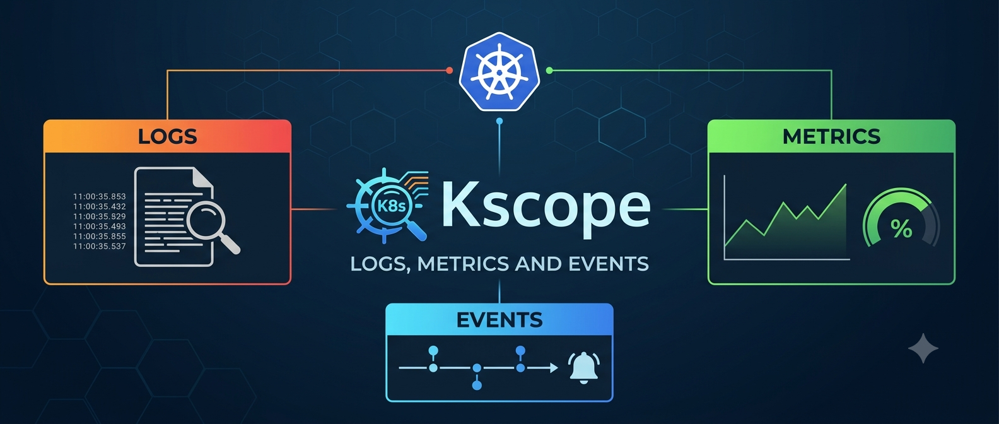

# kscope

**A fast, read-only Kubernetes TUI: browse any resource, then read its logs, metrics and events.**

[](https://github.com/hknerts/kscope/actions/workflows/ci.yml)
[](https://github.com/hknerts/kscope/releases/latest)
[](LICENSE)
[](https://www.rust-lang.org)

kscope is deliberately **read-only**. There is no editing, scaling, deleting or
shelling in. That is the point: it is safe to hand to anyone holding a view-only
token, it cannot be the cause of an incident, and it stays fast because it never
has to be anything else.



## How it works

Two panes, and one key that drives everything:

```
┌─ contexts ─┐┌─ pods · payments ───────────────────────────┐
│ ● prod-eu  ││ namespace  name              status    age  │
│   prod-us  ││ payments   checkout-7d9c     Running   4h   │
│   staging  ││ payments   ledger-58f4       0/1       12m  │
└────────────┘└─────────────────────────────────────────────┘
                             Enter ↓
┌─ contexts ─┐┌ payments/ledger-58f4  1:logs 2:metrics 3:events  Esc: back ┐
│ ● prod-eu  ││ 12:04:11  WARN  retrying payment authorisation            │
└────────────┘└───────────────────────────────────────────────────────────┘
```

* **`:` picks the resource type**, with k9s-style autocompletion — `:po`,
  `:deploy`, `:pvc`, `:no`, or fuzzy input like `:dpy`. The candidate list comes
  from the cluster's own discovery API, so **CRDs complete exactly like built-in
  kinds** and a kind your cluster does not serve is never offered.
* **The left pane lists your kubeconfig contexts.** `Enter` switches cluster in
  place — the client is rebuilt and every poller restarts, without restarting
  kscope.
* **`Enter` opens an object** into three tabs: its logs, its metrics, its
  events. `Esc` goes back to the list.

## Why

Reading logs through `kubectl logs -f` works until you need to page back, grep,
follow three containers at once, or notice that the pod you are debugging is
being OOM-throttled — and then you still have to run `kubectl describe` in
another terminal to find out why it will not start. kscope keeps all of it on
one screen:

* **Logs** — paging, regex search with match highlighting, level filtering,
  automatic error highlighting, multi-container streaming, export to file.
* **Metrics** — live CPU and memory at **node**, **pod** *and* **container**
  granularity, with usage-versus-limit percentages and rolling sparklines.
* **Events** — scoped to the object you have open, warnings separable with one
  key, so "why is this pending?" is one `3` away.

## kscope or k9s?

[k9s](https://github.com/derailed/k9s) is excellent, and kscope is not trying to
replace it. They are built for different halves of the job.

**k9s is a cockpit.** You go there to *act*: scale a Deployment, delete a stuck
pod, edit a ConfigMap, port-forward, shell into a container. It has a plugin
system, skins, benchmarking and an ecosystem.

**kscope is an instrument panel.** You go there to *understand*: what is this
workload printing, what is it consuming, and what has the cluster been saying
about it. Nothing more — and that constraint is what it trades for.

| | kscope | k9s |
| --- | --- | --- |
| Mutating actions | **not implemented** — no write code path exists | full lifecycle, plus `exec` and port-forward; `--readonly` opts out |
| Log history | entire retained history on attach, **unbounded** buffer by default | configurable tail and buffer |
| Log investigation | regex search with match highlighting, include/exclude filters, severity classification, level threshold, errors-only, export to file | search and filter |
| Metrics | node **and** pod **and** container at once, versus requests *and* limits, with rolling sparklines | CPU/MEM columns, cluster pulse |
| Events | scoped to the object you have open, warnings isolable with one key | via `describe` / the events view |
| Scope | logs, metrics, events | the whole cluster surface |

### Why that matters for observation

The difference people actually feel is **who you can hand it to**.

k9s's read-only mode is a runtime flag. It protects a careless keystroke, but the
capability is still compiled in and the flag can be dropped — so handing k9s to a
wider audience is a decision you make about *trust*, backed by RBAC you have to
get right.

kscope has no mutating code at all. Point it at a cluster with a full admin
kubeconfig and it still cannot scale, delete, patch or exec, because none of
those calls exist in the binary. Every request it makes is a `get`, `list` or
`watch`. That gives you defence in depth rather than a single RBAC layer, and it
makes the tool cheap to distribute:

* **On-call and junior engineers** can dig through logs, container memory trends
  and events on production without anyone auditing what else the token permits.
* **Contractors, support and auditors** get a real diagnostic view without a path
  to change anything.
* **Incident calls** stop bottlenecking on the two people who hold write access
  just to read logs.

The practical effect is that looking becomes cheap, so it happens earlier. A
container creeping toward its memory limit, restart counts climbing on one
replica, a `FailedScheduling` event repeating — these are visible in kscope
before they become an outage, to anyone who can be given a view-only token.
kscope will not prevent a bad deploy; it shortens the gap between something going
wrong and somebody noticing.

Plenty of teams will want both: kscope open on the dashboard everyone watches,
k9s in the hands of whoever is authorised to fix what it finds.

## Install

### Release binaries

Binaries for Linux (x86_64, aarch64), macOS (Intel, Apple Silicon) and Windows
are attached to every [release](https://github.com/hknerts/kscope/releases).

```sh
curl -sSfL https://github.com/hknerts/kscope/releases/latest/download/kscope-x86_64-unknown-linux-gnu.tar.gz | tar xz
sudo install kscope /usr/local/bin/
```

### From source

```sh
cargo install --locked --git https://github.com/hknerts/kscope
```

### Container

```sh
docker run --rm -it -v ~/.kube:/home/nonroot/.kube:ro ghcr.io/hknerts/kscope:latest
```

## Usage

```sh
kscope                        # current context, current namespace
                              # (full log history from container start, nothing evicted)
kscope -n payments            # a specific namespace
kscope -A                     # every namespace you can read
kscope --context staging      # start on a specific kubeconfig context
kscope --tail 2000            # only the last 2000 log lines instead of everything
kscope --buffer 200000        # cap memory at 200k lines (ring buffer)
kscope --since 3600           # only lines from the last hour
kscope --dump checkout-7d9c:app > app.log   # non-interactive, for scripts
```

## Key bindings

### Everywhere

| Key | Action |
| --- | --- |
| `:` | pick a resource type (autocompleting) |
| `Tab` | move focus between contexts and resources |
| `Esc` | leave the detail view; from the list, quit |
| `q`, `Ctrl-c` | quit |
| `?` | help overlay |
| `j` `k` `↑` `↓` | move one row or line |
| `←` `→`, `PgUp` `PgDn` | page up / down |
| `Ctrl-u` / `Ctrl-d` | half page up / down |
| `Ctrl-b` / `Ctrl-f` | full page up / down |
| `g` / `G` | top / bottom (bottom re-enables follow) |
| `Ctrl-n` | change the namespace scope |

### In the `:` palette

| Key | Action |
| --- | --- |
| *type* | filter candidates live (prefix, substring or fuzzy) |
| `Tab` | accept the highlighted completion, or cycle matches |
| `↑` `↓` | move through the completions |
| `Enter` | apply |
| `Esc` | cancel |

### Resource list

| Key | Action |
| --- | --- |
| `Enter` | open the object (logs / metrics / events) |
| `1` `2` `3` | open it straight onto logs / metrics / events |
| `/` | filter the list by name or namespace |
| `Ctrl-r` | re-list now |

### Contexts pane

| Key | Action |
| --- | --- |
| `Enter` | switch to that cluster |

### Detail — `1` logs

| Key | Action |
| --- | --- |
| `/` then `n` / `N` | regex search, next / previous match |
| `\` | filter lines; prefix with `!` to exclude |
| `L` / `e` | cycle minimum level / errors only |
| `F` / `w` | toggle follow / wrapping |
| `t` / `p` | toggle timestamps / previous (crashed) container |
| `c` / `s` | clear buffer / save visible buffer to a file |
| `[` `]` | horizontal scroll when wrapping is off |
| `x` | detach all streams |

### Detail — `2` metrics, `3` events

| Key | Action |
| --- | --- |
| `m` / `S` | switch metric table / cycle sort order |
| `W` | events: warnings only |

> Logs are only served for pods — the Kubernetes API has no log endpoint for a
> Deployment. On any other kind the logs tab says so; press `:po` to get back to
> pods.

## How far back can I scroll?

By default, **all the way to the container's first line**. There are no limits
on kscope's side:

* On attach, kscope asks the API server for the container's entire retained
  history (`tail_lines` unset), not a fixed tail.
* The in-memory buffer is **unbounded** by default (`logs.buffer_lines = 0`), so
  nothing is evicted for the lifetime of the session. `g` jumps to the first
  line, always.
* The status bar shows the live line count, so an unbounded session cannot grow
  silently.

Two limits are outside kscope's control, and it is worth knowing them:

1. **Kubelet log rotation.** The API server can only return what is still on the
   node. Kubelet rotates container logs at `containerLogMaxSize` (10 MiB by
   default) and keeps `containerLogMaxFiles` (5 by default) of them. Anything
   older is gone before any tool can read it — `kubectl logs` has the same
   ceiling. For genuinely permanent history you need a log shipper.
2. **Container restarts.** A restart starts a fresh log. Press `p` to read the
   previous, crashed instance instead.

Events have a third: the API server **expires them after about an hour**
(`--event-ttl`). An empty events tab usually means "nothing has happened
recently", not that something is broken.

If you would rather trade history for a memory ceiling, set a cap:

```toml
[logs]
buffer_lines = 200000   # ring buffer; oldest lines are evicted
tail_lines = 5000       # only fetch the last 5000 lines on attach
```

## Configuration

kscope runs with zero configuration. To customise it, drop a file at
`~/.config/kscope/config.toml` (see [`examples/config.toml`](examples/config.toml)):

```toml
[general]
inventory_refresh_ms = 5000
events_refresh_ms = 10000
max_fps = 30

[logs]
buffer_lines = 0     # 0 = unlimited (default): never evict
tail_lines = 0       # 0 = everything the API server still has (default)
smart_case = true

[metrics]
refresh_ms = 5000
history = 240
warn_pct = 75.0
critical_pct = 90.0

[[highlight]]
pattern = 'order_id=[0-9a-f]+'
fg = "#ff8800"
bold = true
```

## Permissions

kscope only ever performs `get`, `list` and `watch` — there is no code path that
writes. Because `:` browses whatever the cluster serves, how much you can see
follows directly from what your token may list.

A role covering the built-in views:

```yaml
apiVersion: rbac.authorization.k8s.io/v1
kind: ClusterRole
metadata:
  name: kscope-viewer
rules:
  - apiGroups: [""]
    resources: ["pods", "pods/log", "nodes", "namespaces", "events",
                "persistentvolumeclaims", "services", "configmaps"]
    verbs: ["get", "list", "watch"]
  - apiGroups: ["apps"]
    resources: ["deployments", "statefulsets", "daemonsets", "replicasets"]
    verbs: ["get", "list", "watch"]
  - apiGroups: ["metrics.k8s.io"]
    resources: ["pods", "nodes"]
    verbs: ["get", "list"]
```

For the full experience — every kind the palette can offer, CRDs included — bind
the built-in `view` ClusterRole instead. Everything degrades gracefully: a kind
you cannot list reports the error in the pane it belongs to and leaves the rest
of the tool working.

## Performance notes

The design targets pods that emit tens of thousands of lines per second:

* Log lines arrive in **batches** (512 lines or 100 ms) so a chatty container
  cannot livelock the render loop.
* Lines are classified into a severity level exactly once, on arrival, and
  stored in an unbounded deque — or a fixed-capacity ring buffer if you set
  `logs.buffer_lines`.
* The filtered view is a list of line ids maintained **incrementally**; only a
  filter change costs a full pass.
* Redraws are capped at `general.max_fps` (30 by default) and only happen when
  something actually changed.
* **Only the visible window is styled** — cost per frame is independent of how
  many lines are in the buffer.
* Discovery and resource listings run off the UI task, so a slow API server
  never freezes the interface.
* Release builds use fat LTO and a single codegen unit.

## Requirements

* A reachable cluster (kubeconfig or in-cluster service account).
* [metrics-server](https://github.com/kubernetes-sigs/metrics-server) for the
  metrics tab. Without it, everything else still works and the metrics pane
  explains what is missing.

## Contributing

Bug reports, feature requests and pull requests are welcome — see
[CONTRIBUTING.md](CONTRIBUTING.md). Everyone participating is expected to follow
the [Code of Conduct](CODE_OF_CONDUCT.md).

## License

Released under the [MIT License](LICENSE).
